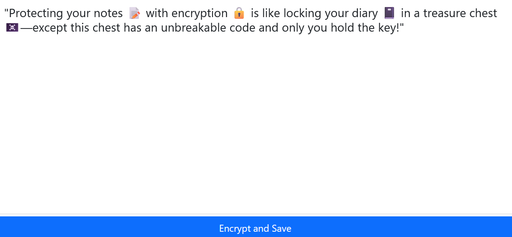

# NOTETAKER WEB APP 🌐📒
#### Video demo: N/A 
#### 🗒️ Description:

NoteTaker is yet another notetaking web app with various functions such as password-protected notes, cloud sync,
and cloud backup. 

The interface of NoteTaker has been designed to be simple, accessible, and polished. The status
bar at the top of the editor gives you an overview of your note entry, including the title, time saved, and document
type. 

If cloud sync is enabled, there will be a sync timestamp as well. 

NoteTaker automatically uploads and updates your notes in the cloud so that you will not lose your important notes. 

An undo and redo function ensures that accidental edits can be undone, so that important data is never lost.

NoteTaker supports importing notes too, so your notes can be within your reach at any time when you need it.

files and description

- `images/`: Screenshots of the web app used in the main page which is `index.html` of the web app
- `favicon.svg`: Favicon icon for the web app
- `index.html`: Main landing page of the app
- `notetaker.css`: CSS file for the web app
- `notetaker.html`: HTML file for the web app
- `notetaker.js`: JavaScript file (the largest file) which runs in the web app
- `README.md`: The README file for this project

##### 🔑 Password-protected Notes

- Encryption, supported by secure browser `crypto` library, is one of the features of NoteTaker. Implementing encryption
was a lesson of patience, and NoteTaker allows selectively encrypting notes with a password so that only you can access
your private notes. 
- Passwords are stored securely in `sessionStorage` within the browser, and notes can be automatically uploaded to the
cloud without any hassle, making E2E encrypted notes easy and accessible. Changing passwords is as easy as a click
of a button. NoteTaker will reliably save your private notes, just remember to bring your password, as the strong 
E2E encryption would make it impossible to recover your lost files if the password is lost.

- In the future, there will be a password lock screen that protects the entire application from being tampered, so that
your notes can be safer.

- For security, the plaintext password is hashed before being used to derive the cryptograhic key, such that the password
is never saved in the browser. Hence, user passwords are protected and never exposed in the unexpected case of a breach.

##### ☁️ Cloud Syncing
- Automatic cloud saves and cloud syncing is supported by NoteTaker. A diligent upload algorithm ensures all files are
kept up to date and NoteTaker automatically updates and keeps the latest files. All you need to do is provide your
S3 credentials and it will be a seamless notetaking experience. Log into your account (with S3 credentials) from any
device and watch as your notes are downloaded automatically from the cloud. NoteTaker Cloud Syncing features saves 
you time and energy so that you can focus on your work.

- Sharing is also a feature. Users can click on the share button once cloud sync is enabled and a shareable link will
allow anyone to download their file, making collaboration a breeze. In the future, it would be possible to implement
collaborative editing, where multiple people can work on the same note at once. For now, NoteTaker is a private notes
app that helps you keep your notes safe, updated, and easy to reach.

##### 🔏 Private Notes
- Your notes are saved to your device only, and your S3 cloud backups are private and confidential. Trust NoteTaker to deliver Secure and trusted password-protected notes paired with easy and seamless notetaking experience. 

- NoteTaker ensures your notes are 
never sold as advertising data to any company by not uploading your data to third-party services or advertisers.
Now, your notes can really be yours. No snooping eyes, no hidden trackers. 

##### ✏️ Multi-tab editing and 📌 edit protection
- Multi-tab editing and edit protection is also supported. Just click on the "Open in New Tab" button and a new browser tab
will open to the target file. Taking advantage of browser tab features, each tab is titled with the title of the currently
opened note and the browser back button can be used to navigate between previously opened files in the same tab.

- In case a note changes while the tab is closed and the note is still unsaved, a notification is shown to ensure the unsaved 
edits are not accidentally erased. Thus, NoteTaker prevents accidental data loss while protecting your notes.

#### 🎊 Impact and community features
- Notetaker provides private notes, easy E2E password protection, and seamless and reliable syncing. There are no insecure
features to compromise you and your data as everything is saved to your browser and the cloud provider of your choice. 
With NoteTaker, users can enjoy a seamless notetaking experience without worry. The basic but polished interface of
NotTaker is what makes it so powerful, as there are no distracting features to distract the user from note taking. Hence,
users can enjoy a truly distraction-free environment.

- The choice of using s3 buckets for cloud syncing is in line with the community requirements. S3 servers are easy to
configure and generally available, allowing users to set it up with NoteTaker with minimal effort. If desired, the notes
can also be locked under a secure AES-128 bit encryption algorithm that ensure notes stay private and free from snoopers.

#### 🎯 Future directions
In the future, it is possible to implement Dropbox / Google Drive syncing. Once implemented, users can log in using 
their google or dropbox account and sync their notes to their accounts. It is also possible to implement versioning
thanks to the powerful versioning features of the S3 servers and other cloud providers. With NoteTaker, the possibilities
are truly endless when it comes to features to implement as there are just so many things to do! Due to the time constraints
however, these features will have to wait for implementation in the future.
